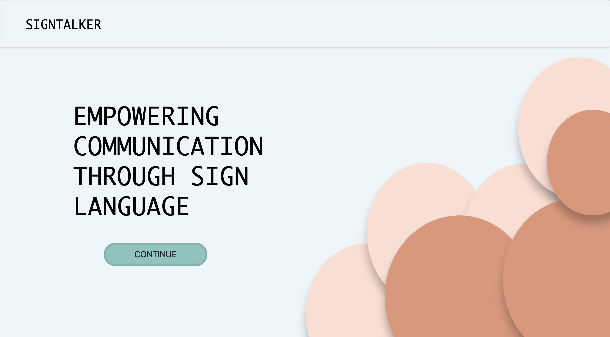
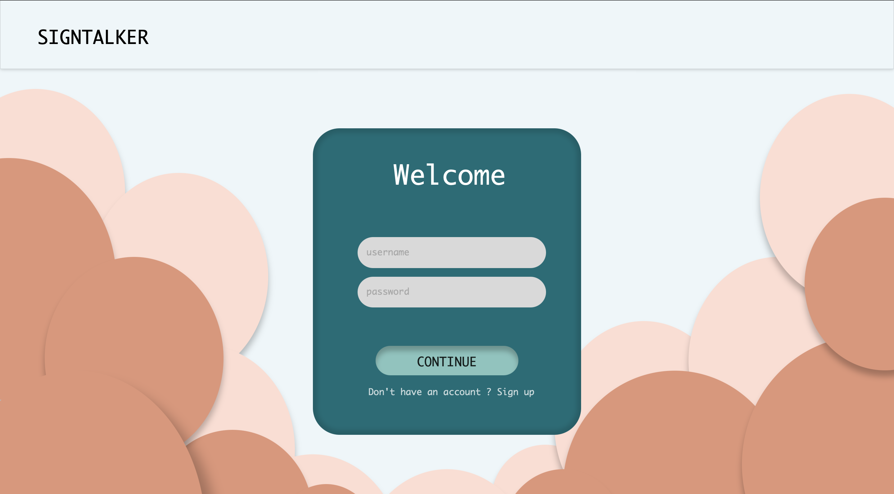
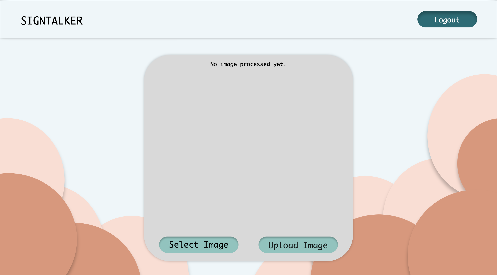
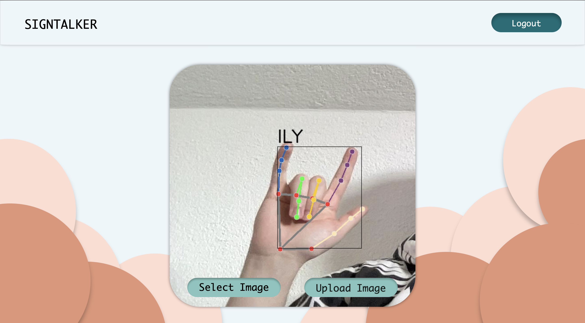
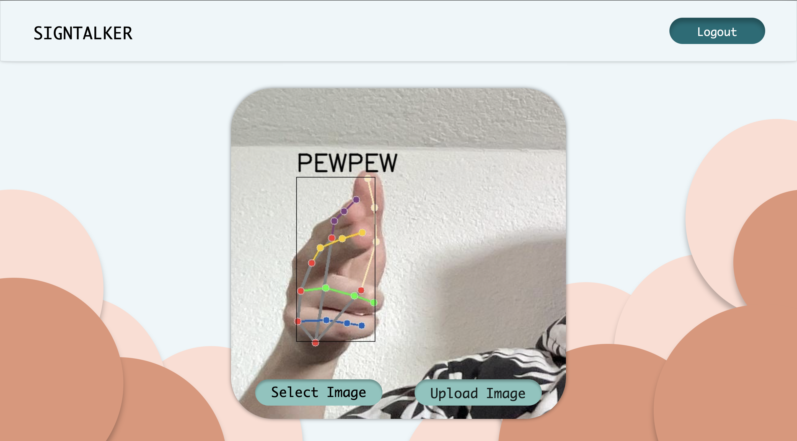

# ZCT-zadanie-2
To-Do List:
  - [x] plakať
  - [x] M F P J: písať bakalárku
  - [x] M: lokálne natrénovať sign language na vyskúšanie
  - [x] M: Vytvorenie dátovej množiny
  - [x] F: MS Azure workspace // AWS workspace // Google Cloud workspace
  - [x] F: Deploy-núť databázu na AWS // Deploy-núť model na Azure ML // Deploy-núť aplikáciu na Google Cloud Run
  - [x] J: UX/UI stránky
  - [x] J: spraviť dokumentáciu -> slovný rozbor a analýzu úlohy, odôvodnenie zvolených technológií, jednoduchý diagram použitých služieb a ich prepojenia, rozpísaný príspevok jednotlivých členov teamu k funkčnosti riešenia, dokumentáciu k používaniu aplikácie (setup, spustenie, vstupy, výstupy)
  - [x] P: Flask backend 
  - [x] P: Spojiť model (Azure ML) do backend-u
  - [x] M F P J: Úpravy, doťuky všetkého. Každý všetko (backend, frontend, model, atď.)

## American Sign Language (ASL)

# SINGTALKER
## not so talkative, but very useful (hopefully)

