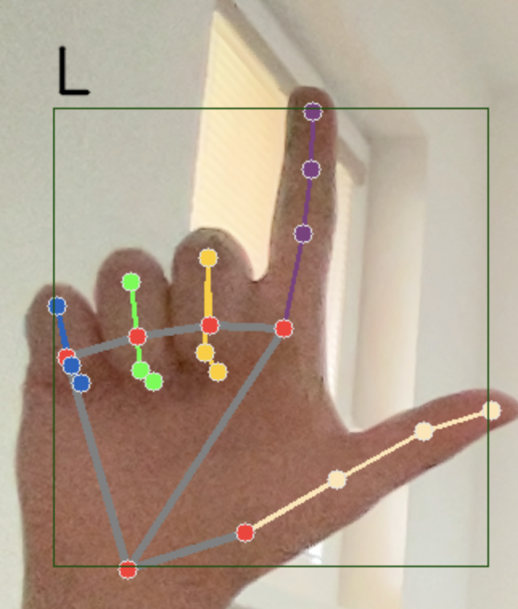
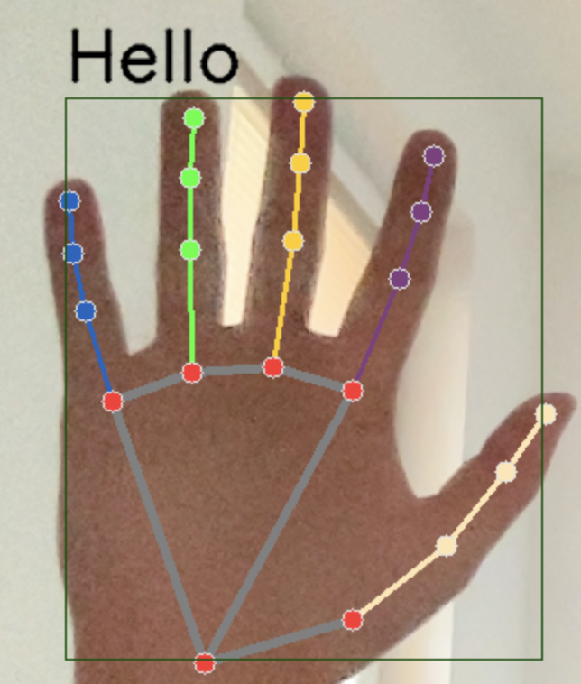

## Folder Model
Tento priečinok obsahuje súbory na získavanie dát z kamery, následne sa obrázky spracujú. Spracovanie spočíva v tom, že 
sa pomocou knižnice mediapipe nájdu body na ruke tzv *landmarks*. Získajú sa súradnice a tie sa uložia do pickle súboru. 
Tento súbor sa následne použije na trénovanie modelu. Ako model bol použitý Random Forest, ktorý na testovacej sade má presnosť 99-100%.
Následne sa tento model uloží a vužije na predikciu posunkovej reči v reálnom čase.

### Súbory
- `data_collection.py` - súbor na získanie dát z kamery,
- `hand_landmarks.py` - súbor na získanie bodov na ruke,
- `model.py` - súbor na trénovanie modelu a následného uloženia,
- `main.py` - súbor na spustenie programu, ktorý zobrazuje predikciu posunkovej reči v reálnom čase.

### Inštalácia
Pre nainštalovanie potrebných knižníc použite príkaz:
`pip install -r path/requirements.txt`